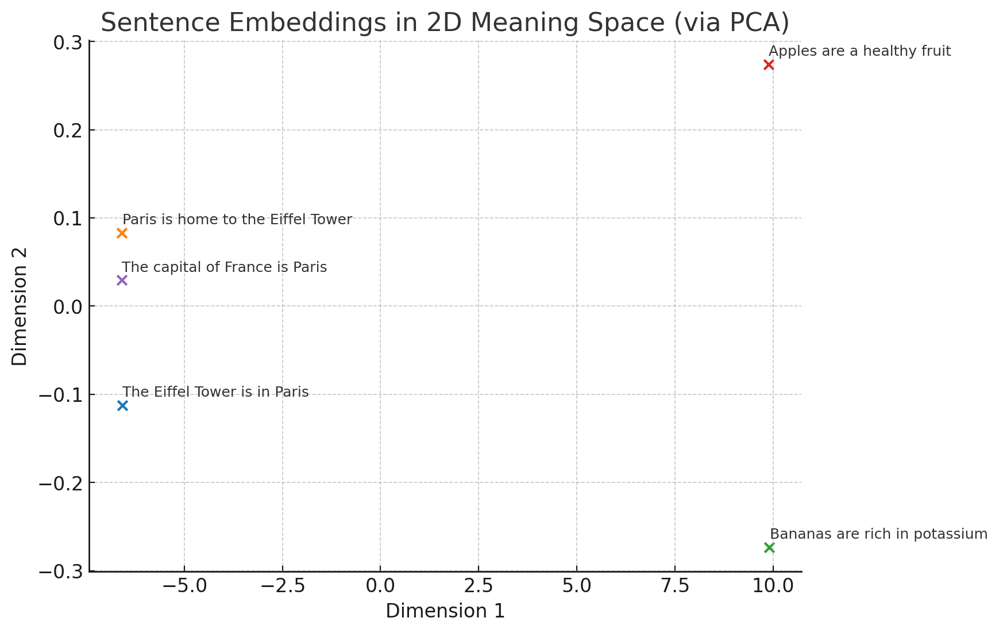

Each embedding in that vector is **not** tied to a specific letter or word.

Here’s how it works:

* Your whole text — `"Eiffel Tower is in Paris and is a famous landmark, it is 324 meters tall"` — is first broken into **tokens** (subword chunks, not individual characters).

  * Example: `"Eiffel"`, `" Tower"`, `" is"`, `" in"`, `" Paris"`, etc.
* The embedding model **processes the entire sequence of tokens** together and produces **one single vector** that represents the *overall meaning* of the text in a high-dimensional space.
* Each number in that 1,536-length vector isn’t “the meaning of word X” — instead, the *entire set of numbers together* encodes semantic relationships.

Think of it like this:

* It’s similar to a GPS coordinate, but instead of `x, y, z`, you have **1,536 dimensions**.
* The vector’s position in this giant “semantic space” is chosen so that **similar texts end up near each other** and dissimilar ones end up far apart.

If you want **per-word embeddings**, you’d have to pass each token or word separately into the embedding model and get multiple vectors — but the default API call returns **one vector for the entire input string**.

When you passed this string:
```
"Eiffel Tower is in Paris and is a famous landmark, it is 324 meters tall"
```

The model didn’t give you a vector per word — `it gave you one single embedding that represents the meaning of the whole sentence.`
When I say an embedding **"represents the meaning of the whole sentence"**, I mean:

It’s a **point in a huge mathematical space** (like a coordinate in thousands of dimensions) where:

* Sentences that mean **similar things** are placed **close together** in that space.
* Sentences that mean **different things** are placed **far apart**.

For example, in embedding space:

* `"The Eiffel Tower is in Paris"` will be **very close** to `"Paris is home to the Eiffel Tower"`.
* But it will be **far away** from `"Bananas are rich in potassium"`.

The numbers in your vector are what position that sentence in this semantic space — kind of like a “GPS coordinate for meaning.”

So the embedding doesn’t care about **exact words**, but rather **the concepts and relationships** those words express.

Here’s a visual idea of what I meant:

Each dot is the **vector embedding of an entire sentence**, reduced from 1536 dimensions to 2D for plotting.

* Sentences about **Paris/Eiffel Tower** cluster close together.
* Sentences about **bananas/apples** cluster elsewhere.

`The embedding for a sentence captures its **overall meaning**, not just individual words.`


---
 A quick Python example of how to get **embeddings per word** instead of per text:

```python
from dotenv import load_dotenv
from openai import OpenAI

load_dotenv()

client = OpenAI()

text = "Eiffel Tower is in Paris and is a famous landmark, it is 324 meters tall"

# Split into words
words = text.split()

# Get embeddings for each word individually
response = client.embeddings.create(
    input=words,
    model="text-embedding-3-small"
)

# Print each word with its embedding vector length
for i, word in enumerate(words):
    vector = response.data[i].embedding
    print(f"Word: {word}")
    print(f"Vector length: {len(vector)}")  # Should be 1536 for this model
    print(f"First 5 numbers: {vector[:5]}\n")  # Preview
```


- you can store these vector embeddings in vector dbs (pine cone,chroma,quadrant db etc)