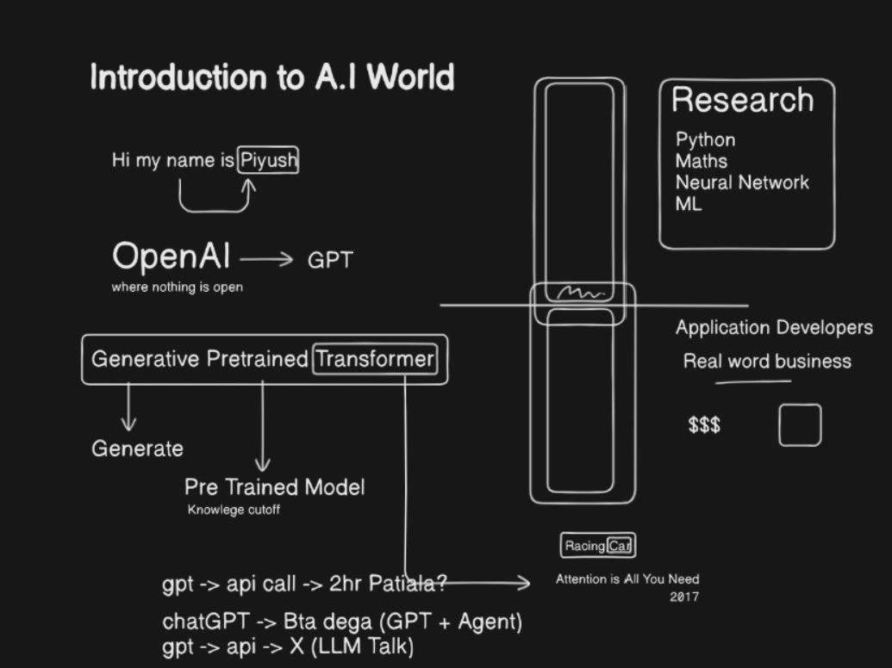
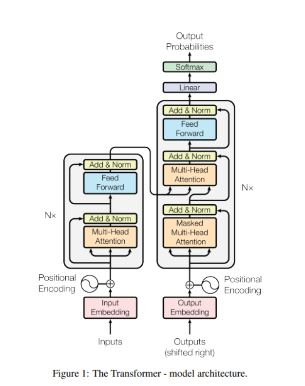

# Introduction

https://app.eraser.io/workspace/WVuECSpptFUySQegvL2b

https://arxiv.org/pdf/1706.03762

Embeddings → Numeric representations of data (text, images, audio, etc.) in a multi-dimensional space so that similar things are close together.

Vector embeddings → The same thing — the term “vector” just emphasizes that the embedding is a vector (an ordered list of numbers).
So “vector embeddings” is just a more explicit way of saying “embeddings,” since embeddings are inherently vectors.

- vector embedddings vizualization
https://projector.tensorflow.org/
- a model has 2 phases => `training` and `inferencing`
- `Positional encoding` => different embedding based on the position of tokens

- `Self Attention Mechanism` => Here we give the tokens an opportunity to talk to each other and update themselves (change their semantic meaning based on the sentence)
- `Multiple head attention` => means focusing on different aspects of the token (it's position, what is ahead of it,what's behind it etc)

- `Feed Forward` layer => neural netwrok comes here